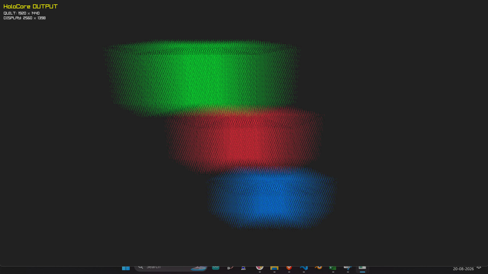
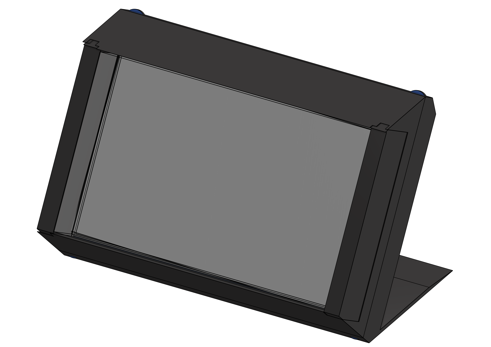

# HoloCore

Experimental light-field display software and hardware.

HoloCore generates multi-view quilts from a 3D scene and sends them
through a light-field shader to a lenticular display.


## What I've built

| Part | Status |
|---|---|
| Custom 3D editor | Done |
| 48-view rendering | Done |
| 6 × 8 quilt generation | Done |
| Light-field shader | Done |
| Separate display output process | Done |
| Shared-memory frame transfer | Done |
| Multi-monitor output | Done |
| Custom UI system | Done |


## Pipeline

| Stage | Description |
|---|---|
| 1 | 3D Scene |
| 2 | 48 Views |
| 3 | Quilt |
| 4 | Light-field Shader |
| 5 | Display |



> You know what this reminds me of?
>
> 
>
> **Reverse Flash.**

## Hardware

The goal is to build a physical light-field display using an LCD,
lenticular sheet, and acrylic optical stack.

I want to build this.


And after some calculation:


I started on the CAD:


And my "ahh moment":

[Looking Glass — Light Field Display](https://www.youtube.com/watch?v=ImMIfI01zs8)


| Step 1 | Step 2 | Step 3 | Step 4 |
|---|---|---|---|
|  |  |  |  |

The glass block is used to **add depth** between the display and the
lenticular sheet.



The CAD files are available on Onshape and in the repository.

## Software

The current software implementation is developed in
[HoloCore-farmware](https://github.com/Nitin-2468-dev/HoloCore-farmware).

## Project

HoloCore-farmware is the software/firmware implementation of
[HoloCore](https://github.com/Nitin-2468-dev/HoloCore).

## Run

```bash
uv sync
uv run Core.py
```

----

### License See [LICENSE](LICENSE). 
